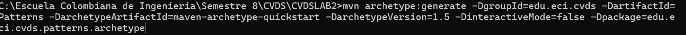
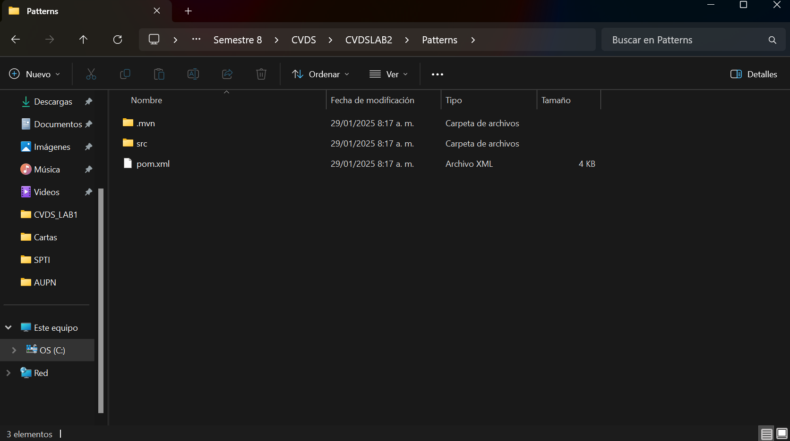
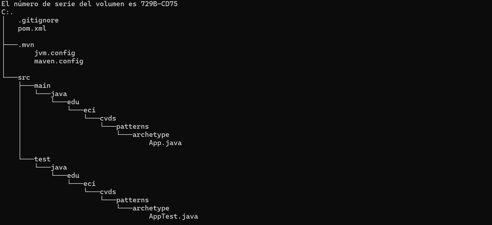
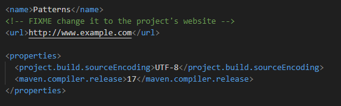
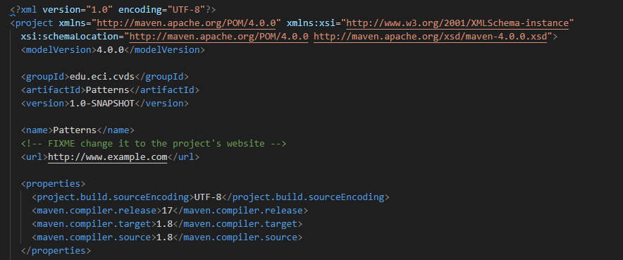
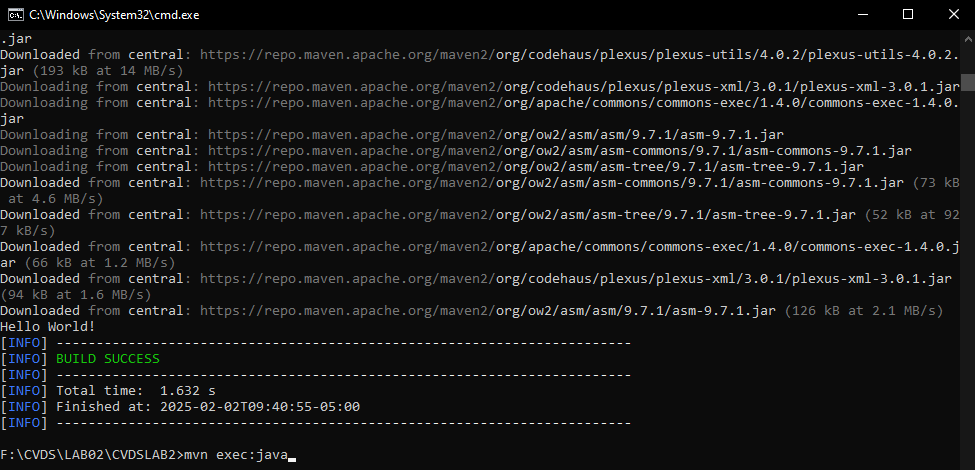
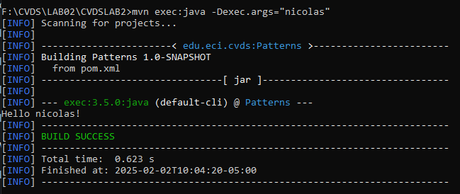
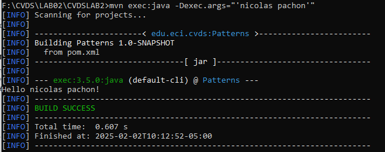

# Laboratorio #2 CVDS

### Integrantes:
- Juan Andres Rodriguez Peñuela
- Nicolas Pachon Unibio

### Preguntas

#### Cuál es su mayor utilidad

Maven tiene como principal utilidad que permite el manejo de librerias utilizadas en java, generando que a la hora de trabajar en proyectos entre dos o mas personas, no se generen conflictos en sus librerias y se trabajen con la misma version y asimismo, bajo el mismo estandar.

#### Fases de maven y ciclo de vida en la construcción

El ciclo de vida en un proyecto en maven se define por sus fases, cada una encargada de una actividad diferente con el fin de garantizar el buen manejo de un proyecto, siendo las siguientes fases:

- **Validate:** Encargado de verificar que la informacion presente en el proyecto este correcta.

- **Compile:** Compila el codigo fuente presente en el proyecto.

- **Test:** Realiza las respectivas pruebas de unidad en el codigo compilado.

- **Package:** Tiene como funcionalidad el empaquetar el codigo en su respectivo ejecutable.

- **Verify:** Realiza los respectivos tests de integracion para confirmar que se ha cumplido con los requerimentos de cualidad solicitados.

- **Install:** Instala el paquete en el respectivo repositorio local para ser usaco domo dependencia en otros proyectos guardados de forma local.

- **Deploy:** Finalmente, copia el paquete final en el repositorio remoto para que pueda ser compartido y usado por otros desarrolladores o proyectos.

#### Para que sirven los plugins

Los plugins son las palabras clave, o mejor dicho comandos, que se realizan en la consola con la finalidad de que maven ejecute una instruccion en el proyecto o carpte en el que se encuentre presente, estos se dividen en dos tipos, siendo el primero el de construccion y el segundo el de reportes.

#### Qué es y para qué sirve el repositorio central de maven

El repositorio central de maven es, como el nombre indica, un repositorio que tiene la distincion de ser un lugar donde se pueden encontrar librerias y artefactos presentes en proyectos de maven, sirve para manejar elementos en los repositorios locales tales como las dependencias, compatibilidad y versiones de librerias.

### Crear un proyecto con maven

Para generar un proyecto en maven basado en arquetipos se debe tener en cuenta que los comandos seran realizados desde el cmd, siendo especificamente el comando **mvn archetype: create** que es utilizado para generar proyectos basades en unos paramteros, en esta coasion siendo los siguientes:

- ProjectId
- GroupId
- ArtefactId
- Package

Dando como resultado el siguiente comando:

Y por consecuente, se presento el siguiente resultado indicando que fue añadido satisfactoriamente:

El cual posee la siguiente estructura de arbol:

 

### Ajustar algunas configuraciones en el proyecto

Se añadieron las configuraciones mencionadas en la ultima seccion de properties.

#### Antes

#### Despues

### Compilar y ejecutar

Al ultilizar el commando "**mvn package**" nos demostro la siguiente pantalla, por lo cual no fue necesario hacer uso del "**-U**" al tener las dependencias actualizadas. Posteriormente se ejecuto el archivo "**App.java**" bajo el siguiente comando:

Esto nos brindo el "Hello World!" por defecto presente en el archivo, el cual modificamos para que acepte un argumento de entrada, en este caso el nombre del usuario.

Luego la problematica que surgio es que al separar con un espacio el nombre y apellido, este contaba como argumentos distintos y no uno solo, para arreglar se hace el uso de comilllas simples (  **' '**  ) para tomarlo como un solo argumento incluyendo sus espacios, dandonos el siguiente resultado:

